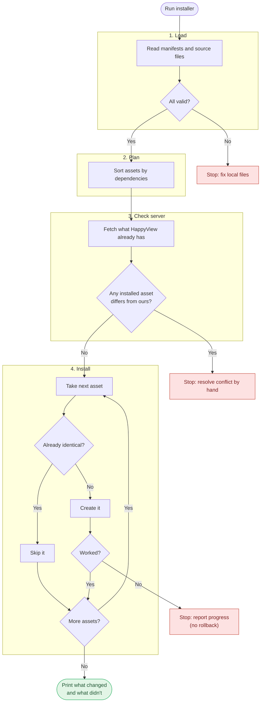

# Hypercerts API for HappyView

This directory contains the tooling for building and testing a Hypercerts XRPC API on HappyView. It provides a reusable installer for HappyView admin assets (Lexicons and Lua scripts), pinned Hypercerts Lexicon dependencies, and test fixtures for checking record behavior. The installer lets API modules declare their assets together, install missing assets in dependency order, and refuse to overwrite assets that differ from what is already installed.

**Current status:** The root `manifest.json` includes the location API bundle. Build its Lua handlers and run the offline checks before installing it on an approved HappyView target.

## Get started

From `hypercerts-api/`:

```sh
pnpm install --frozen-lockfile
pnpm build:lua
pnpm test:unit
```

These checks run offline; they do not require a running HappyView instance or database. `build:lua` builds the standalone location handlers in `lua/endpoints/`. The bundle combines local API Lexicons and scripts with schemas from the pinned `@hypercerts-org/lexicon` package. HTTP contract tests require an installed bundle and a separately approved disposable target.

## Bootstrap a running HappyView instance

After those offline checks pass, run this from `hypercerts-api/` to install the bundle on an approved, running HappyView instance. Unlike the checks above, this command contacts the instance and uploads assets.

For an interactive run, start the installer and enter the requested URL and admin token when prompted. Token input is hidden. Any nonblank values already set in the environment are used, and the installer prompts only for missing values.

```sh
pnpm install:api
```

For a noninteractive run, provide both values in the environment:

```sh
HAPPYVIEW_BASE_URL='https://your-happyview.example' \
HAPPYVIEW_ADMIN_TOKEN='<scoped-admin-token>' \
pnpm install:api
```

## How an API bundle is installed

Once an API bundle supplies a root `manifest.json` and its referenced module manifests, the installer loads Lexicon and Lua script sources, checks dependencies and existing admin assets, and only writes missing assets. It skips unchanged assets and stops on conflicts so you can resolve them manually. An installation is not an all-or-nothing transaction: if a write fails, the installer reports what it already installed and what remains.



The root manifest lists module manifests once:

```json
{ "modules": ["modules/shared/manifest.json", "modules/location/manifest.json"] }
```

Each module manifest declares `{ "assets": [...] }`. Assets have an `id`, `kind` (`lexicon` or `script`), `config`, and optional `dependsOn` asset IDs. Lexicons point to a `packagePath` in `@hypercerts-org/lexicon` or a local `path`; scripts use a local `path`. Local paths are relative to the **module manifest that declares them**. Declare shared assets in one module and reference their IDs from dependent modules. The installer rejects duplicate IDs, missing dependencies, cycles, and invalid source files before making admin requests.

The bootstrap command above should target only an explicitly approved HappyView instance. It sends `Authorization: Bearer <token>`; session-cookie authentication is not supported.

The token must have `lexicons:read` and `lexicons:create` for lexicon assets. If the bundle includes scripts, it also needs `scripts:read` and `scripts:manage`. If a manifest requests backfill for a new record lexicon, `backfill:create` is additionally needed to start that job; without it, the lexicon is still uploaded but no backfill starts. Remote targets must use HTTPS; HTTP is allowed only on `localhost`, `127.0.0.1`, or `::1`. URL credentials and HTTP redirects are rejected. Resolve installed-asset conflicts manually. The location handlers and fixtures require PostgreSQL.

## Test fixtures (disposable databases only)

The fixture tools seed records directly into PostgreSQL, bypassing HappyView ingestion. Use them **only with a separately approved, disposable loopback test database**, never persistent data. The `seed:test` and `seed:bad-dates` scripts require `HAPPYVIEW_DISPOSABLE_TEST_TARGET=YES`, a loopback `PGHOST`, a `PGDATABASE` name containing a `test` marker, and an absolute `PSQL_PATH` to a trusted `psql` executable. Standard `PGPORT` and `PGUSER` can select the test instance and user. The normal `seed:test` command seeds location, profile, and organization examples by default; `seed:bad-dates` seeds only location examples by default. Both tools also accept supplied record rows through `buildSeedInput` and `buildBadDateSeedInput` in `tooling/seed.js`.

Fixture CIDs are computed from stored record JSON with `@atcute/cbor` and `@atcute/cid`. If you seeded an older version of the blob-backed fixture, reseed the **disposable test database** before comparing CIDs: the earlier `jsonToLex` conversion produced a different CID.

After confirming the approved disposable PostgreSQL database is the one used by the installed HappyView instance, run `pnpm seed:test` and `pnpm test:contracts` with `HAPPYVIEW_BASE_URL` set to that instance. Optionally run `pnpm seed:bad-dates` and then `pnpm test:bad-dates` on the same target. These commands are not part of the offline unit suite; seeding bypasses ingestion and tests only the read path.
