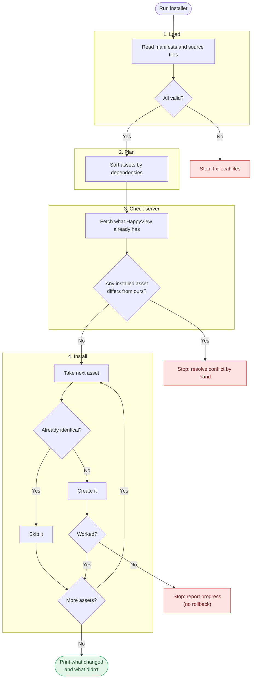

# Hypercerts API for HappyView

This directory contains the tooling for building and testing a Hypercerts XRPC API on HappyView. It provides a reusable installer for HappyView admin assets (Lexicons and Lua scripts), pinned Hypercerts Lexicon dependencies, and test fixtures for checking record behavior. The installer lets API modules declare their assets together, install missing assets in dependency order, and refuse to overwrite assets that differ from what is already installed.

**Current status:** The root `manifest.json` includes the location, actor-follow, profile, organization, activity, and collection query slices. Build their Lua handlers and run the offline checks before installing the bundle on an approved HappyView target. Only the location and actor-follow slices have runtime validation at the target revision; profile, organization, activity, and collection query HTTP proof remains unrun.

The actor-follow slice exposes `app.certified.graph.getFollow`, `app.certified.graph.listActorFollowers`, and `app.certified.graph.listActorFollowing`, backed by the pinned `app.certified.graph.follow` record Lexicon. Both listing queries return a required `totalCount` for the complete deduplicated relationship set, independent of cursor and limit. Lookup and listings sort follows by `createdAt`; if it is missing or malformed, they use `indexed_at` (or the database insertion time when `indexed_at` is absent) so those follows remain visible and counted.

The profile slice exposes `app.certified.actor.getProfile`, `app.certified.actor.getProfiles`, `app.certified.actor.listProfiles`, and `app.certified.actor.searchProfiles`. `getProfiles` requires 1–100 supplied actor DIDs, counting duplicates before deduplication; it preserves input order and duplicates, returns an explicit `null` profile for missing actors, does not resolve handles or make network requests, and does not paginate. `listProfiles` accepts actor DIDs and pagination only; use `searchProfiles` for a required profile-text query over `displayName` and `description`. Both list and search preserve the original profile record and do not attach organization sidecars. `getProfile(actor=DID)` performs a direct indexed lookup without a resolver request. For `getProfile(actor=handle)`, set the HappyView instance script variable `HYPERCERTS_HANDLE_RESOLVER_URL` to an HTTPS resolver origin. Each Lua execution reads that setting and calls `com.atproto.identity.resolveHandle` at the configured resolver's `/xrpc/` endpoint; no per-request override or bsky.social default is used. A syntactically valid DID in that resolver response is accepted as identity confirmation: the operator trusts the selected resolver, and HappyView does not independently fetch or verify a DID document. Removing arbitrary `did:web` document fetching removes that specific SSRF path; this change does not secure resolver redirects or broader outbound egress. Use `listProfiles` when no text restriction is intended.

The organization slice exposes `app.certified.actor.getOrganization`, `app.certified.actor.listOrganizations`, and `app.certified.actor.searchOrganizations`. Each result includes the original organization sidecar with record metadata and publisher DID, plus the associated profile or explicit `null`; a missing sidecar fails singular lookup and is omitted from listings. Listing filters combine with AND, while values within `actors` and `organizationTypes` use OR. A supplied visibility is an exact match; omitting it includes public, unlisted, and unspecified values. Search matches the complete trimmed, case-insensitive literal text within the associated profile's `displayName` or `description`; an organization without a profile cannot match nonblank text. Both listing endpoints use `(createdAt, uri)` ordering and direction-bound cursors. Founding-date range parameters are not part of this API.

The activity slice exposes `org.hypercerts.claim.getActivity`, `org.hypercerts.claim.listActivities`, and `org.hypercerts.claim.searchActivities`. Singular lookup uses an exact activity AT-URI. All three responses preserve the original activity record and hydrate the publisher's Certified profile and organization sidecar. Contributor hydration is returned as a sibling projection: it preserves source order and duplicates, omits the projection only when `record.contributors` is absent, and keeps an explicit empty array empty. Contributor-information strong references resolve only by exact URI and CID; a newer version at the same URI is never substituted. DID and AT-URI contributor identifiers hydrate Certified profiles when resolvable; external or unrecognized identifiers remain visible with `actor: null`. Missing related records remain nullable, while query or required hydration failures fail the request. Activity and hydrated exact-version contributor-information views always include `indexedAt`: SQL `NULL` in `indexed_at` is returned as JSON `null`, while non-null timestamps are strings.

`listActivities` accepts `authors`, `hasOrganizationRecord`, `contributors`, `involvedActors`, and activity `uris`; different filters combine with AND and values within each array use OR. `hasOrganizationRecord=true` requires an `app.certified.actor.organization/self` record, while `false` requires its absence; neither value depends on whether the author has a profile. `searchActivities` has those filters plus required text search over literal, case-insensitive substrings in `title` or `shortDescription`. Listings default to 25 results and cap pages and each filter array at 100 values. They sort by `(createdAt, uri)` and use an opaque cursor bound to sort direction. Use repeated, unbracketed query keys for arrays.

The collection slice exposes `org.hypercerts.collection.getCollection`, `listCollections`, `searchCollections`, and `listCollectionItems`. `getCollection` looks up the exact collection AT-URI. List and search accept `authors`, `hasOrganizationRecord`, exact open-string `types`, collection `uris`, reverse `itemUris`, and conjunctive `tagUris`. `hasOrganizationRecord=true` requires an `app.certified.actor.organization/self` record; `false` requires its absence regardless of profile presence. Distinct filters combine with AND; `authors`, `types`, `uris`, and `itemUris` use OR within each filter, while every requested tag URI must occur in the collection. Item and tag matching compares reference URIs only. Duplicate array values are removed.

`searchCollections` searches the complete trimmed text as a case-insensitive literal substring of either `title` or `shortDescription`; blank-after-trimming text adds no search restriction. Collection lists default to 25, cap pages and each array filter at 100 values, sort by `(createdAt, uri)`, and use a cursor bound to sort direction. Collection views preserve the stored record unchanged, hydrate the author, and project exact-version location and tag references; a missing referenced version is `null`, and each projection is omitted only when its source field is absent. Collection-owned record views keep `indexedAt` required and serialize a SQL `NULL` timestamp as JSON `null`, including for profile and organization author sidecars.

`listCollectionItems` defaults to 25 and caps pages at 100. It preserves embedded item order, strong references, and weights; resolves exact URI+CID versions of activities, features, and nested collections one level deep; and returns `null` for unavailable or unsupported targets. Malformed embedded items (including references without a URI or CID) are omitted without a warning; pagination advances past them to fill the requested page when possible. Its cursor follows the latest indexed collection at the same URI rather than pinning a collection version, so edits between pages may skip or repeat items. Counts and dataset targets are not part of this slice. Array query parameters use repeated, unbracketed keys.

## Get started

From `hypercerts-api/`:

```sh
pnpm install --frozen-lockfile
pnpm build:lua
pnpm check
```

These checks run offline; they do not require a running HappyView instance or database. `build:lua` builds the standalone location, actor-follow, profile, organization, activity, and collection handlers in `lua/endpoints/`. `pnpm check` verifies the generated Lua bundles are current, runs JavaScript and Lua lint, a strict `checkJs` typecheck of the installer, then the offline unit tests; run `pnpm run typecheck` to run just the typecheck. TypeScript is a development-time checker only: the installer remains JavaScript and runs directly with Node, with no transpilation. Run `pnpm check:generated` to check bundle freshness on its own; it does not modify files. If it fails, run `pnpm build:lua` and review the generated changes. The bundle combines local API Lexicons and scripts with schemas from the pinned `@hypercerts-org/lexicon` package. HTTP contract tests require an installed bundle and a separately approved disposable target. Only location and actor-follow slices have runtime validation at the target revision; profile, organization, activity, and collection query HTTP proof remains unrun.

ESLint is installed with the package dependencies. It uses ESLint's recommended checks plus strict equality, no implicit coercion, no shadowed names, no reassigned parameters, no `var`, and `const` where possible. It also rejects direct `eval`, implied evaluation (such as string-based timers), and `Function` constructors. Console output is allowed only in CLI tooling, and unused ESLint disable directives fail lint. When a branch contains Lua scripts, Luacheck checks the generated handlers in `lua/endpoints/`; it rejects unknown globals, sandbox-removed Lua APIs, and unused arguments. It rejects `io`, `debug`, `package`, `require`, `dofile`, `loadfile`, `load`, `collectgarbage`, and unsafe `os` functions; only `os.time`, `os.date`, `os.difftime`, and `os.clock` are allowed from `os`. Only the HappyView `handle` global is writable; `db`, `http`, `json`, `params`, and `toarray` are read-only. It targets Lua 5.4 and skips line-length checks for long SQL expressions. Install Lua 5.4 and LuaRocks, then run `luarocks --lua-version=5.4 --local install luacheck 1.2.0` to enable that check locally. The lint runner also finds the default `~/.luarocks/bin` install if it is not on `PATH`. Branches without Lua files skip Luacheck. If Lua sources exist but generated handlers are missing, run `pnpm build:lua` first.

## Bootstrap a running HappyView instance

After those offline checks pass, run this from `hypercerts-api/` to install the bundle on an approved, running HappyView instance. Unlike the checks above, this command contacts the instance and uploads assets.

For an interactive run, start the installer and enter the HappyView URL and admin token when prompted. Token input is hidden. If the bundle contains `getProfile` and `HYPERCERTS_HANDLE_RESOLVER_URL` is absent from HappyView, the installer also prompts for the resolver HTTPS base URL after checking existing assets and script variables. A pre-existing resolver variable is not prompted for or changed; HappyView only exposes its key and masked preview, so the installer cannot verify its actual value. Any nonblank HappyView URL/token values already set in the environment are used.

```sh
pnpm install:api
```

For a noninteractive run, provide both values in the environment:

```sh
HAPPYVIEW_BASE_URL='https://your-happyview.example' \
HAPPYVIEW_ADMIN_TOKEN='<scoped-admin-token>' \
HYPERCERTS_HANDLE_RESOLVER_URL='https://your-resolver.example' \
pnpm install:api
```

## How an API bundle is installed

Once an API bundle supplies a root `manifest.json` and its referenced module manifests, the installer loads Lexicon and Lua script sources, checks dependencies and existing admin assets, and only writes missing assets. It skips unchanged assets and stops on conflicts so you can resolve them manually. An installation is not an all-or-nothing transaction: if a write fails, the installer reports what it already installed and what remains.


```mermaid
flowchart TD
    Start(["Run installer"]) --> Load

    subgraph S1["1. Load"]
        Load["Read manifests and source files"] --> Valid{"All valid?"}
    end

    subgraph S2["2. Plan"]
        Order["Sort assets by dependencies"]
    end

    subgraph S3["3. Check server"]
        Fetch["Fetch what HappyView already has"] --> Conflict{"Any installed asset<br/>differs from ours?"}
    end

    subgraph S4["4. Install"]
        Each["Take next asset"] --> Same{"Already identical?"}
        Same -- Yes --> Skip["Skip it"]
        Same -- No --> Post["Create it"]
        Post --> OK{"Worked?"}
        Skip --> More{"More assets?"}
        OK -- Yes --> More
        More -- Yes --> Each
    end

    Valid -- Yes --> Order --> Fetch
    Conflict -- No --> Each
    More -- No --> Done(["Print what changed<br/>and what didn't"])

    Valid -- No --> Stop1["Stop: fix local files"]
    Conflict -- Yes --> Stop2["Stop: resolve conflict by hand"]
    OK -- No --> Stop3["Stop: report progress<br/>(no rollback)"]

    classDef stop fill:#fde2e2,stroke:#c0392b,color:#7b1f1f
    classDef done fill:#e2f5e6,stroke:#27ae60,color:#1e5631
    class Stop1,Stop2,Stop3 stop
    class Done done
```

The root manifest lists module manifests once:

```json
{ "modules": ["modules/shared/manifest.json", "modules/location/manifest.json"] }
```

Each module manifest declares `{ "assets": [...] }`. Assets have an `id`, `kind` (`lexicon` or `script`), `config`, and optional `dependsOn` asset IDs. Lexicons point to a `packagePath` in `@hypercerts-org/lexicon` or a local `path`; scripts use a local `path`. Local paths are relative to the **module manifest that declares them**. Declare shared assets in one module and reference their IDs from dependent modules. The installer rejects duplicate IDs, missing dependencies, cycles, and invalid source files before making admin requests.

The root manifest's `validationLexicons` is the complete local schema closure used by Lexicon validation; it does not define what the installer uploads. Only assets listed in a module's `assets` array are deployed. The location module intentionally leaves package-backed support schemas in the validation closure without deploying them. Removing an asset from a manifest affects future installer runs only; the installer does not unregister assets already on the HappyView instance.

The bootstrap command above should target only an explicitly approved HappyView instance. It sends `Authorization: Bearer <token>`; session-cookie authentication is not supported.

The token must have `lexicons:read` and `lexicons:create` for lexicon assets. If the bundle includes scripts, it also needs `scripts:read` and `scripts:manage`. For a bundle containing `getProfile`, it needs `script-variables:read` to check whether `HYPERCERTS_HANDLE_RESOLVER_URL` exists, and `script-variables:create` if that key is absent and must be set. HappyView's list response contains only keys and masked previews. The installer lists keys before prompting or creating the resolver variable and never deletes or intentionally overwrites an existing key. The HappyView POST endpoint is an upsert, so a concurrent change after the list preflight can still race with creation and overwrite the setting; avoid changing this key concurrently during installation. If a later asset write fails after setting creation, the installer reports that the setting remains and does not attempt rollback. If a manifest requests backfill for a new record lexicon, `backfill:create` is additionally needed to start that job; without it, the lexicon is still uploaded but no backfill starts. Remote admin targets must use HTTPS; HTTP is allowed only on `localhost`, `127.0.0.1`, or `::1`. Admin URL credentials and redirects are rejected. Resolver URLs must be an HTTPS origin with no credentials, path, query, or fragment. Hosts may be DNS names, IPv4 addresses, or syntactically valid bracketed IPv6 addresses; optional ports must be between 1 and 65535. Resolve installed-asset conflicts manually. The location, actor-follow, profile, organization, and activity handlers, and the fixtures, require PostgreSQL.

## Test fixtures (disposable databases only)

The fixture tools seed records directly into PostgreSQL, bypassing HappyView ingestion. Use them **only with a separately approved, disposable loopback test database**, never persistent data. The `seed:test` and `seed:bad-dates` scripts require `HAPPYVIEW_DISPOSABLE_TEST_TARGET=YES`, a loopback `PGHOST`, a `PGDATABASE` name containing a `test` marker, and an absolute `PSQL_PATH` to a trusted `psql` executable. Standard `PGPORT` and `PGUSER` can select the test instance and user. The normal `seed:test` command seeds location, profile, organization, actor-follow, and activity/contributor-information examples by default; `seed:bad-dates` seeds only location examples and remains separate. `pnpm test:contracts` runs the location, actor-follow, organization, and activity HTTP contract suites; `pnpm test:bad-dates` remains a separate opt-in suite. Both seed tools also accept supplied record rows through `buildSeedInput` and `buildBadDateSeedInput` in `tooling/seed.js`.

Fixture CIDs are computed from stored record JSON with `@atcute/cbor` and `@atcute/cid`. If you seeded an older version of the blob-backed fixture, reseed the **disposable test database** before comparing CIDs: the earlier `jsonToLex` conversion produced a different CID.

After confirming the approved disposable PostgreSQL database is the one used by the installed HappyView instance, run `pnpm seed:test` and `pnpm test:contracts` with `HAPPYVIEW_BASE_URL` set to that instance. Optionally run `pnpm seed:bad-dates` and then `pnpm test:bad-dates` on the same target. These commands are not part of the offline unit suite; seeding bypasses ingestion and tests only the read path.
